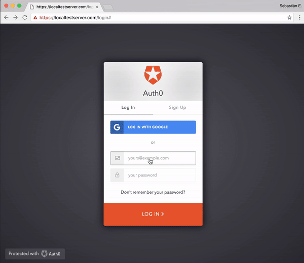
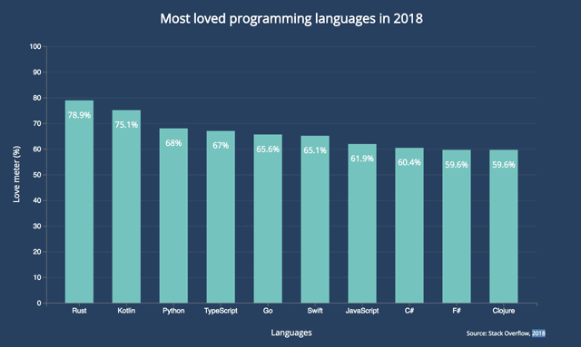
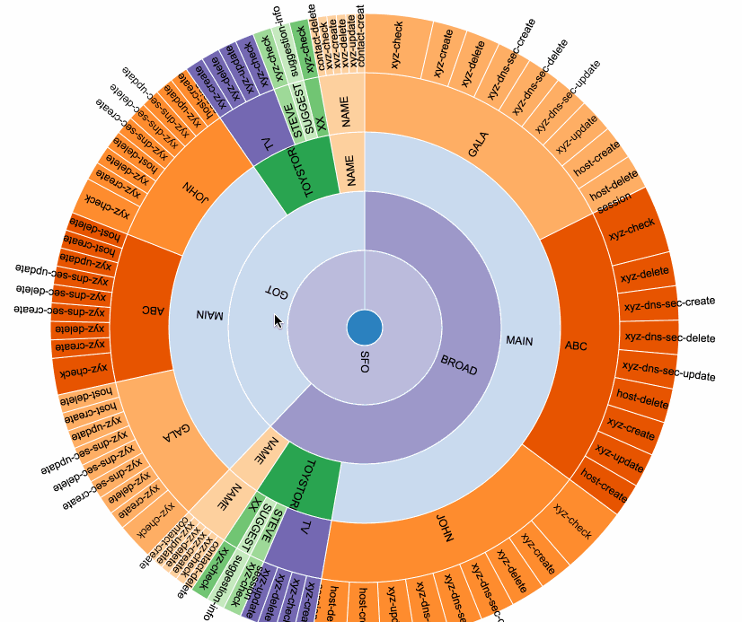

# dhh2018 회의록 

## 18.10.18

* 멘토링 의견 확인 

## 18.10.17

* 전재형, 강민지 회의 참석 불가

## 18.10.09

* [아이디어 제안서](presentation/anpanman_dhh2018.pptx) 제출 & 업로드 

## 18.10.08

### 목표: **시연용 통계 앱 제작**

* 공통 참고 자료 

    + [R 홈페이지](https://www.r-project.org/), [Rstudio](https://www.rstudio.com/), [Shiny](https://shiny.rstudio.com/)
    
    + [자체 앱 모음](https://blog.anpanman.co.kr/applications.html) 

### 전재형 

* 딥러닝을 **Shiny app**으로 구현한 예시

* [R interface to Keras](https://keras.rstudio.com/), [TensorFlow for R](https://blogs.rstudio.com/tensorflow/)

### 이유진 

* **Shiny app** 에 패스워드 기능 추가한 예시 

* [예: 별개의 로그인 화면](https://auth0.com/blog/adding-authentication-to-shiny-server/)

* [예: 앱 자체 구현](https://stackoverflow.com/questions/41168459/r-shiny-user-authentication-for-single-app-r)

### 강민지

* 데이터 시각화 툴 **D3**를 **Shiny app**에 구현한 예시 

* [D3 example](https://github.com/d3/d3/wiki/Gallery)

* [**r2d3** R package](https://rstudio.github.io/r2d3/articles/learning_d3.html)

### 모임 일시 

* 10월 20일(토) 저녁 7시, 삼성서울병원 별관 7층 안과 의국

### 클라우드 신청 

* 네이버 클라우드 신청함

## 18.10.06

* 팀빌딩 - 강민지, 김재령, 김진섭(팀장), 이유진, 임동희, 전재형 

* 팀이름 - Anpanman