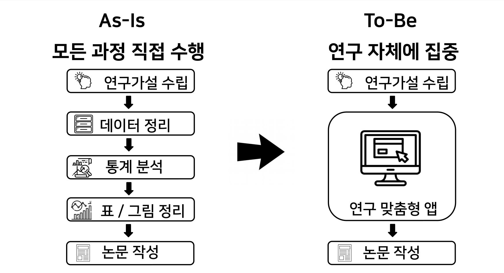
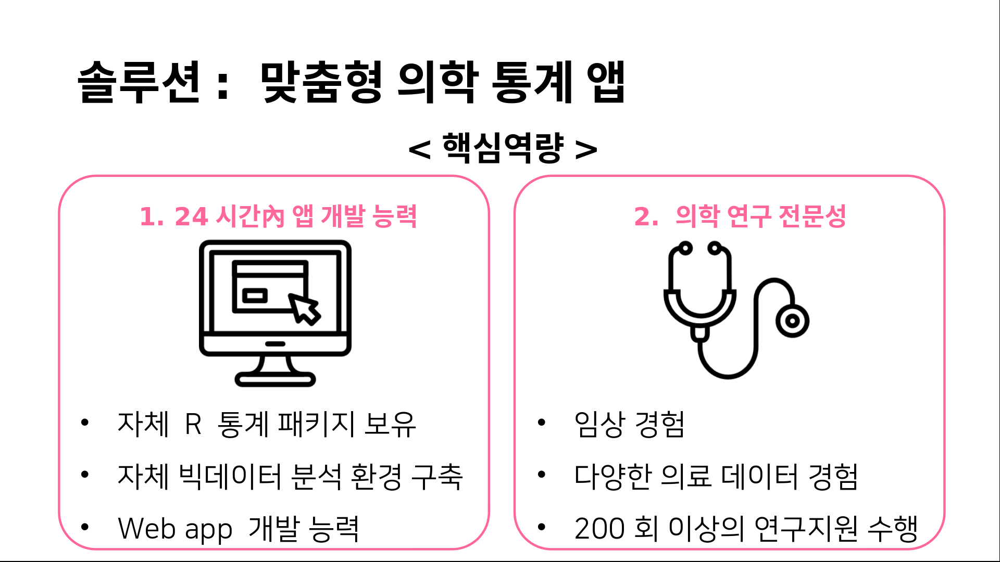

```{r setup, include=FALSE}
knitr::opts_chunk$set(echo = FALSE)
library(knitr)
```

# 문제 

의학 연구자가 통계분석을 직접한다?

- 어렵다. 

- 시간이 없다. 


# 그래도 연구는 해야 된다. 

- 전문의가 되려면 

- 학위를 따려면 

- 통계지원실이 없더라도

- 연구원이 없더라도 

- 전공의가 없더라도 

- 대학원생이 없더라도


#

```{r, out.width = "90%"}

```

#

```{r, out.width = "90%"}

```


# 심장질환 위험인자 연구: 계명대 동산의료원

```{r, out.width = "100%"}
include_app("http://147.47.68.165:2222/ds010042/REFERRAL/",  height = "100%")
```


# 맞춤형 앱 - 이완기 압력 계산: 삼성서울병원

```{r, out.width = "100%"}
include_app("http://147.47.68.165:2222/chkh/dPR", height = "100%")
```


# 맞춤형 앱 - 대장암 환자 연구: 강릉아산병원

```{r, out.width = "100%"}
include_app("http://147.47.68.165:2222/yschoi/" ,  height = "100%")
```


# 범용 앱 - 기본 의학통계 

```{r, out.width="100%"}
include_app("http://147.47.68.165:2222/basic/",  height = "100%")
```


# 범용 앱 - 환자 대조군 Propensity score 매칭 연구

```{r, out.width = "100%"}
include_app("http://147.47.68.165:2222/ps/",  height = "100%")
```


# 건강설문조사 리포트

```{r, out.width = "100%"}
include_app("http://147.47.68.165:2222/health-report",  height = "100%")
```


# 향후 계획

- 웹기반 임상연구관리시스템(e-CRF) 연계. 

- 심평원, 보험공단 빅데이터용 앱 개발.


# 고객 

**삼성서울병원** 

- 이주명 교수(순환기내과) : 공동연구 `Circulation` accept. 

- 한종철 교수(안과) : 맞춤형 앱 및 통계자문 계약

- 임동희 교수(안과)

- 김재령(안과), 최기홍, 김지훈(순환기내과), 고경래(정형외과), 김명섭(영상의학과) 임상강사


**중앙대병원**

- 이나미 교수(소아과)


**계명대 동산의료원**

- 남창욱, 조윤경 교수(순환기내과)


# 삼성서울병원에 입주하고 싶습니다.{.bigger}

창업자 옆엔 VC, 연구자 옆엔 Anpanman


# Q & A{.bigger}


