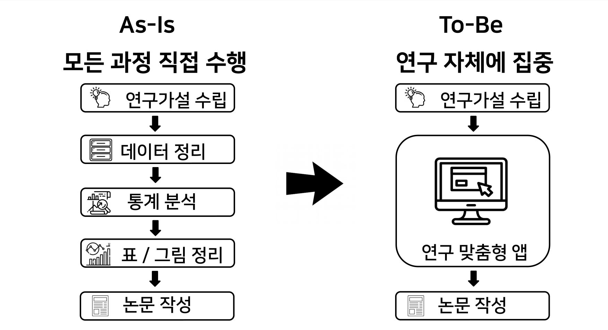
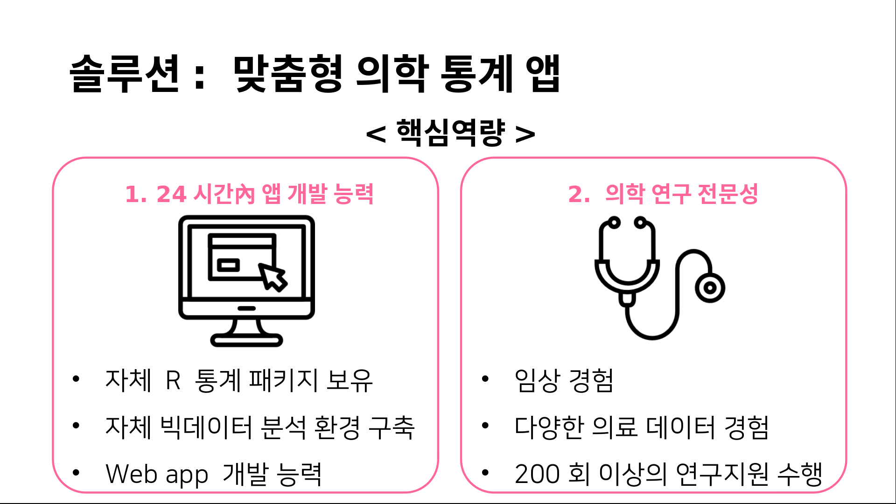

```{r setup, include=FALSE}
knitr::opts_chunk$set(echo = FALSE)
library(knitr)
```

# 문제 

의학 연구자가 통계분석을 직접한다?

- 어렵다. 

- 시간이 없다. 


# 그래도 연구는 해야 된다. 

- 전문의가 되려면 

- 학위를 따려면 

- 통계지원실이 없더라도, 늦게 해주더라도

- 연구원이 없더라도 

- 전공의가 없더라도 

- 대학원생이 없더라도

#

```{r, out.width = "90%"}

```

#

```{r, out.width = "90%"}

```


# 기본 의학통계 

```{r, out.width="100%"}
include_app("http://147.47.68.165:2222/basic/",  height = "100%")
```


# 순환기 내과 - 환자 대조군 매칭 연구

```{r, out.width = "100%"}
include_app("http://147.47.68.165:2222/ps/",  height = "100%")
```


# 맞춤형 앱 - 이완기 압력 계산: 삼성서울병원

```{r, out.width = "100%"}
include_app("http://147.47.68.165:2222/chkh/dPR", height = "100%")
```


# 맞춤형 앱 - 대장암 환자 연구: 강릉아산병원

```{r, out.width = "100%"}
include_app("http://147.47.68.165:2222/yschoi/" ,  height = "100%")
```


# 심장질환 위험인자 연구: 계명대 동산의료원

```{r, out.width = "100%"}
include_app("http://147.47.68.165:2222/ds010042/REFERRAL/",  height = "100%")
```


# 건강설문조사 리포트

```{r, out.width = "100%"}
include_app("http://147.47.68.165:2222/health-report",  height = "100%")
```


# 기존 통계서비스와 차별점 

- 24시간內

- 무한피드백 

- 어떤 형태든 맞춤형으로 

- 논문용 테이블과 그래프를 직접 다운로드 


**100만원 (시장가 10%)**


# 삼성서울병원에 입주하고 싶습니다.{.bigger}

창업자 옆엔 VC, 연구자 옆엔 Anpanman


# 팀원

팀장 

- 김진섭 : 예방의학 전문의, 前삼성전자 무선사업부 


개발 

- 강민지(디자인) : **D3** 시각화 예제 

- 전재형(딥러닝) : **딥러닝** 앱 예제

- 이유진(보안) : **로그인** 모듈 개발

의료전문가

- 임동희 : 삼성서울병원 안과 교수 

- 김재령 : 삼성서울병원 안과 임상강사 


# Q & A{.bigger}


